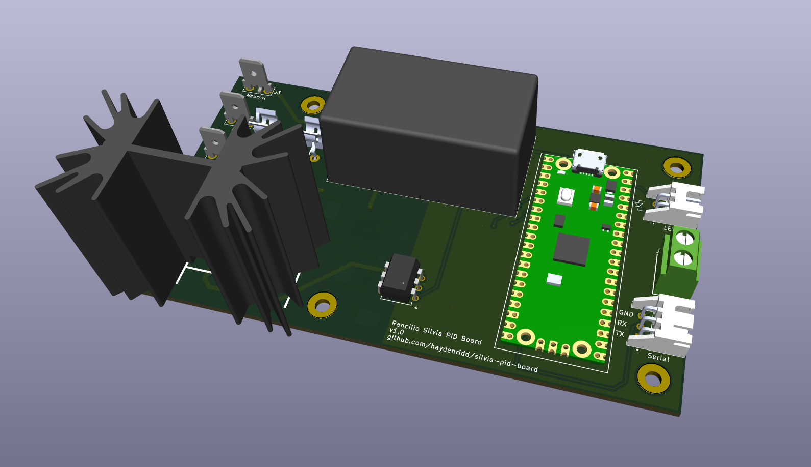
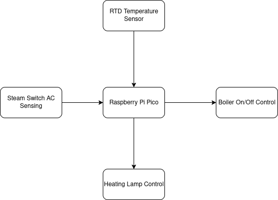
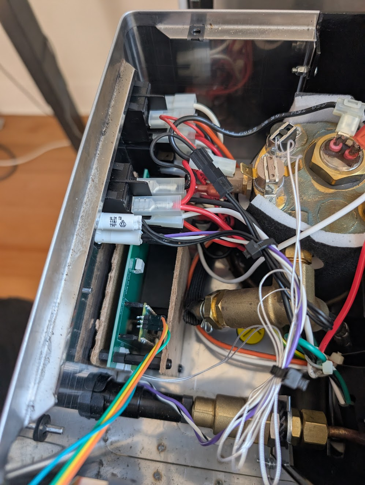
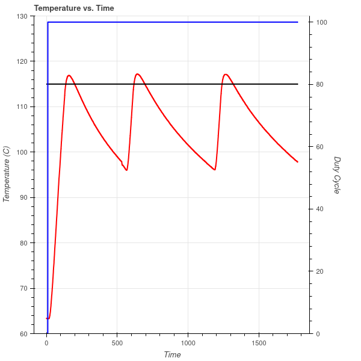
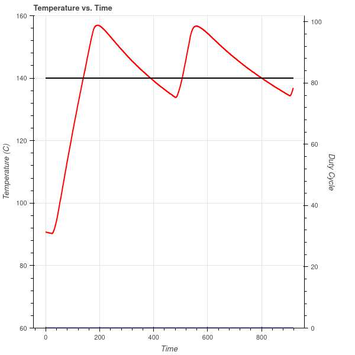
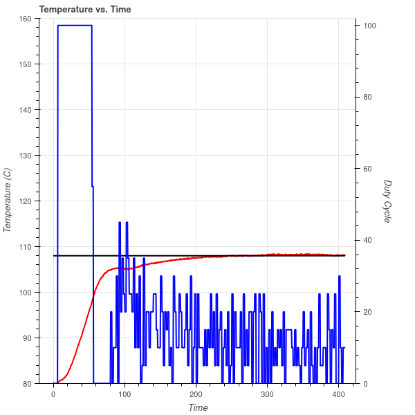
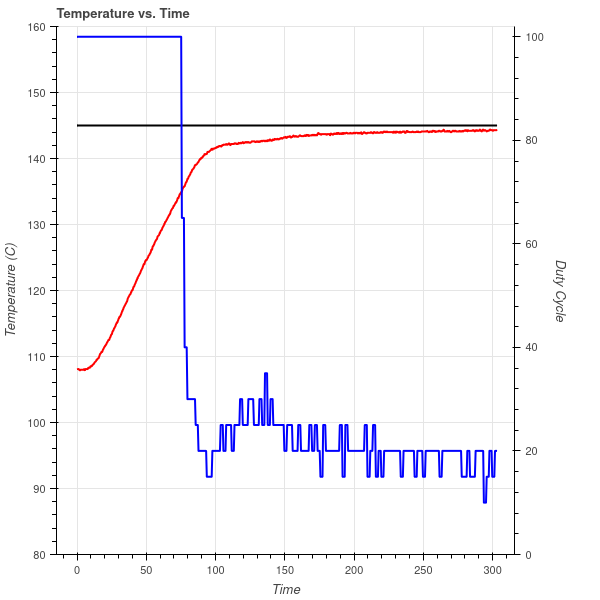

# Rancilio Silvia PID Board

A hardware and firmware project for adding PID boiler control to a stock Rancilio Silvia espresso machine.

## Obligatory Disclaimer

This project involves working with mains voltage as well as high power output heaters! Mains voltage *can kill or
seriously injure you* and improper control of an ~850W heating element *can start fires*. This project is provided
as-is with no regulatory certifications or guarantees of safety. It is on the user to do their due diligence in
ensuring their own safety, as well as the safe modification and operation of the espresso machine.

## Motivation

Adding PID heater control to the Rancilio Silvia is a popular mod, however it usually involves adding a
standalone PID controller like [this][https://www.auberins.com/index.php?main_page=product_info&products_id=36] to the
exterior of the machine. I've also seen a
number of great write-ups on home-brew mods \(so to speak\) like [this](https://misssilviapi.wordpress.com/) and
[this](https://int03.co.uk/blog/project-coffee-espiresso-machine/). However, many of the mods have
gravitated towards using various parts and modules found on Amazon, and are generally fairly invasive to the machine
itself (modules on the outside, cutting into the chassis, etc).

I had two goals with this project:
- Design a robust PID control board and source components entirely from a reputable distributor (DigiKey in this case)
- Design the board in such a way that it fits inside the machine, and leaves the control of the machine unchanged

### A Brief Aside on Amazon Parts
At the time of this writing, the electrical engineer in me would *not* consider Amazon to be a reputable retailer
for electronic parts. There have been many [reports](https://www.coffeeforums.co.uk/threads/gaggia-classic-pid-owners-watch-out-for-counterfeit-ssrs-on-ebay-amazon-etc.61314/)
of [fake parts](https://squashpractice.com/2024/01/01/counterfeits-parts-ebay-scammers-and-amazon-shills/) coming from
Amazon across all corners of industry. While these are generally ~half the price of the part they're
knocking off, you have essentially no recourse or accountability should this part fail in a catastrophic way. And
when it comes to switching AC mains and high powered heaters, that was not a gamble I was willing to take. This
project sources its parts entirely from DigiKey with the exception of a custom RTD sensor for the boiler.

## Design Ethos

I love the chunky, tactile feel of the stock Silvia machine. I wanted to leave how you control the machine entirely
unchanged. This is NOT a total conversion mod like the [Gagguino](https://gaggiuino.github.io/#/) although that project
is certainly cool. Post-mod, the machine still looks and functions largely the same to the external user, with a
small exception being how I use the heating lamp to indicate temperature status.

## Hardware Design

See [the hardware README](./silvia_pid_board/README.md) for a detailed breakdown of the electronic design, parts list,
and hookup diagram. This diagram shows the high-level design of the board:

The board, in a hacky chip board "enclosure", fits snugly in between the steam valve and the leftmost control switches:

## Firmware Design

A Raspberry Pi Pico was used for the microcontroller driving the hardware because they're cheap, and extremely well
documented. The firmware is written in [Zig](https://ziglang.org/), a fantastic up-and-coming language that I've
fallen in love with for low-level firmware development. See [the firmware README](./firmware/README.md) for more
details.

## Performance

The following shows the temperature behavior of the thermostat style regulation that comes with a stock Silvia. 

A graph of temperature over time at the espresso temperature setpoint:

And a graph of temperature of time at the steam temperature setpoint:

Compare this to the new PID regulation at the espresso setpoint:

And regulation at the steam setpoint:

Where the red line is temperature, and the blue line is duty cycle of the heater. Both of these plots can be produced
with a [script](firmware/scripts/graph_temperature.py) in the firmware folder. See that README for more details on
data logging + plotting.

Espresso setpoint regulation is extremely tight, generally regulating to within 1C. Steam regulation generally sits
~2C below the setpoint of 145C, but experimentally I found this to produce nice milk steaming pressure. Both setpoints were chosen based
on the behavior of the original thermostat + some experimental tweaking. It should be noted temperature is measured
at the exterior of the boiler, meaning a setpoint of 108C does *not* mean 108C water is going through your
espresso puck. 

## Building Your Own

All the tools you need to make one of these modules yourself are provided in this repository. I used JLPCB to build the
boards, however the gerber files located in `silvia_pid_board/board_gerbers` can be used to build boards at a PCB
fab of your preference. Note though that design rules were checked according to JLPCB's capabilities. The KiCAD design
files are also available in `silvia_pid_board` should you want to modify the board or run different design rule checks.

At the time of writing, the total BOM cost of the Digikey parts is $34. Should you choose to use the same RTD module
costing $28, and JLPCB for your fab costing ~$30 with shipping, and add some cash for shipping from Digikey, the total
cost sits ~$100 for a buildout of this. Pretty good considering an off the shelf module is ~$150! I've included the 
Digikey part numbers with the [parts list](./silvia_pid_board/parts_list.csv) where relevant, so ordering parts for
this build should be fairly straightforward.

## Closing Thoughts and Areas of Improvement

This repo is unlikely to see any major updates, and mostly serves as a write-up/how-to for anyone looking to replicate
or expand upon this project. In its current state, it does exactly what I want for my machine. However, here are some
minor things I would change if I were to do another revision of the board/firmware:
- Add a standardized SWD header to the board + route corresponding signals from the Pico for easier debugger
connection
- Solder the RP2040 + required supporting ICs directly to the board to save space rather than using the Pico board
- Add CAD designs for a 3D printable enclosure
- Implement a serial port via a USB endpoint, removing the need for a dedicated UART connection
- Expand on the CLI and logging capabilities
