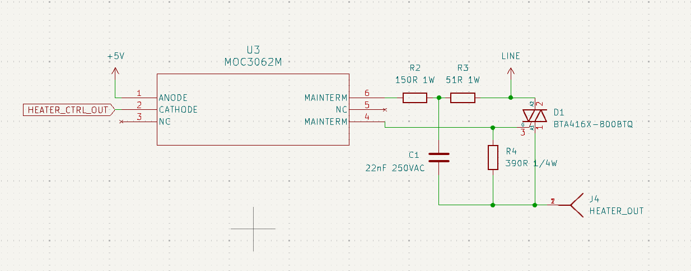
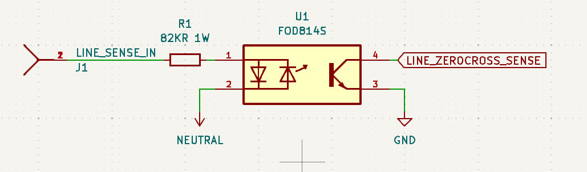
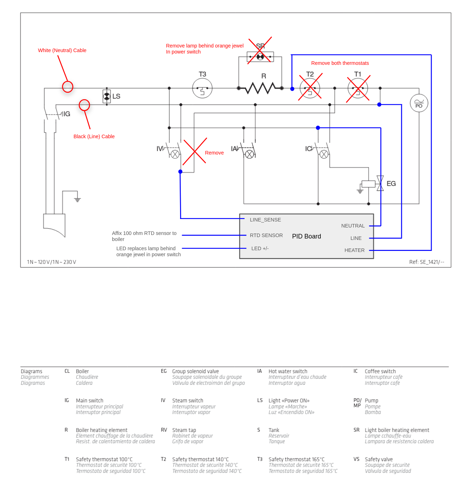

# Hardware Design

The following outlines:
- Board circuit design
- Hookup/wiring guide
- Board mounting
- BOM/Fabrication info

## Circuit Design

A PDF of the board schematic can be found [here](./silvia_pid_board.pdf), and is useful for following along with
circuit design discussion. The circuit design for this board can be broken into the following components:
- Power supply
- AC mains switching for the boiler
- AC mains detection from the steam switch
- Heating LED control

Note that this PCB was designed with a 120VAC/60Hz mains supply in mind, and that a careful design review should be
conducted if a user wants to adapt this to a different mains input (for instance 220VAC).  

### Power Supply

Extremely simple and easy, as it is a single component, the [IRM-05](https://www.meanwellusa.com/upload/pdf/IRM-05/IRM-05-spec.pdf).
While you could probably design a switched power supply that produces 5V from AC mains voltage for a little cheaper (this part costs $7),
this part simplified a lot of headaches. Does exactly as advertised, produces a clean 5V DC from 120 VAC delivering up
to 5W of power.

### AC Mains Switching

I spent the most time and intention on this part of the design, and switching AC to the boiler (to heat it) is
accomplished with the following circuit:

This was carefully designed based on the [following application note](https://www.st.com/resource/en/application_note/an5114-controlling-a-triac-with-a-phototriac-stmicroelectronics.pdf)
from ST Micro. I will be the first to admit it's over-engineered, as it almost certainly doesn't need a snubber circuit
given it's a simple resistive load being switched. One should note that the opto-coupler used is zero-crossing, meaning
no matter when the MCU goes to switch the heater on/off, it will only switch at the zero crossing point of the AC waveform.
Note you can only switch the heater on/off as fast as the frequency of the AC input (60Hz for US), however given the
duty period of the control loop is slow (one second) it doesn't matter.

The triac used for switching is passively cooled using a board mounted heatsink. Note that experimentally this has
been plenty effective for dissapating heat, but that a redesign is likely in order if switching a higher power heater
than the Silvia's.

### AC Mains Detection

This was entirely in service of allowing the steam switch to still turn on its own integrated AC powered lamp when it
switches on/off. The following circuit:

Detects when the steam switch has been flipped "on" by detecting an AC signal. The [FOD814S](https://www.onsemi.com/download/data-sheet/pdf/fod814-d.pdf)
makes this quite easy. The `LINE_ZEROCROSS_SENSE` signal will end up being pulled to ground every time the AC signal
is over the turn-on voltage of the in-package photo-diodes. See the [firmware README](../firmware/README.md) for more
details on how this signal is used.

### Heating LED Control

The lower lamp on the power switched that is used as a heating indicator in the stock Silvia is replace by a white LED
controlled by the microcontroller. The dimensions of the chosen LED are quite similar to the stock lamp, so it was quite
easy to replace the stock lamp while preserving its housing and orange jewel lens. See the [firmware README](../firmware/README.md)
for more info on how this is used, but the general idea is a solid LED means "off target", a pulsing LED means
"close to target", and an off LED means "at target". 

## Hookup/Wiring Guide

The following is an annotated version of the electrical diagram provided with the Silvia's manual. It shows which
electrical connections have been removed or re-routed, and which signals they connect to on the PCB.

18 gauge wire was used for all AC signal level connections, and 22 gauge wire was used for all MCU signal
level connections (RTD sensor and LED).

## Board Mounting + Enclosure

Mounting holes are provided in the PCB to accomodate M3 size screws. I ended up using nylon standoffs and screws to
sandwich the board between two pieces of thick card-stock like material. 

## BOM/Fabrication

See [the following CSV](./parts_list.csv) for a full parts list for the project. The "Notes" column details whether the part goes on the
board itself, or is an ancillary part used for connections/etc.

The gerber files for getting this board fabricated are located in [board_gerbers](./board_gerbers), and pass the design
rules in `silvia_pid_board.kicad_dru` (provided by JLPCB).

